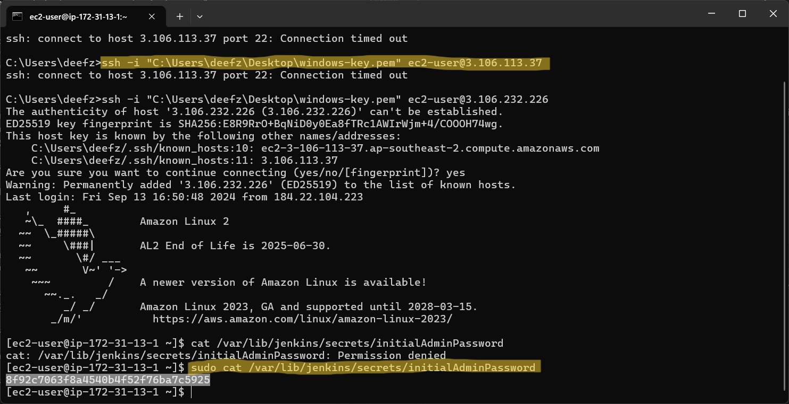
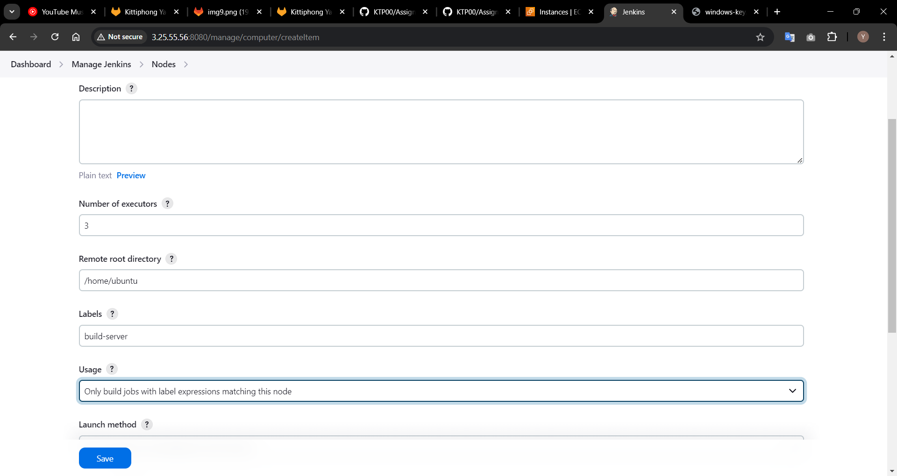

# SoftDev : Assignment 4 Jenkins & Pineline 
## ติดตั้ง Jenkins บน AWS
[Jenkins on AWS reference link](https://www.jenkins.io/doc/tutorials/tutorial-for-installing-jenkins-on-AWS/#installing-and-configuring-jenkins)
- ### สร้างและตั้งค่า Instances(VM) สำหรับ Jenkins ขึ้นมากก่อน
- ### เมื่อสร้าง Instances เสร็จแล้วจึงติดตั้ง Jenkins ลงใน Instances
### Overview Step ( ดูได้จากในเว็บไซต์ด้านบน )
**ขั้นตอนทั้งหมดในการสร้าง Instance ไปจนถึง ติดตั้งและ config Jenkins**
1. Prerequisites
1. Create a key pair using Amazon EC2. If you already have one, you can skip to step 3.
1. Create a security group for your Amazon EC2 instance. If you already have one, you can skip to step 4.
1. Launch an Amazon EC2 instance.
1. Install and configure Jenkins.
1. Clean up tutorial resources.

## Step 1  Prerequisites.
ทำการสมัครสมาชิก AWS ให้เรียบร้อย
## Step 2 Create a key pair
1. เปิด  Amazon EC2 console : [https://console.aws.amazon.com/ec2/](https://console.aws.amazon.com/ec2/)
1. ไปที่ Navigation pane -> NETWORK & SECURITY -> Key Pairs
1. คลิก Create key pair
1. ตั้งค่าตามภาพ แล้วกด create
    
1. ดาวน์โหลดไฟล์ .pem ไว้ที่ Desktop ใช้เป็น key สำหรับ ssh
1. จะปรากฎ key pair ชื่อที่เราพึ่งสร้างขึ้นมา
    
1. หมายเหตุ ถ้าใช้ macOS จะต้อง set permissions .pem file
    ```
    chmod 400 <key_pair_name>.pem
    ```
## Step 3 Create a security group
1. ไปที่ Navigation pane -> NETWORK & SECURITY ->  Security Groups
1. คลิก Create security group
1. ตั้งค่า Basic details
    
1. ตั้งค่า Inbound rules โดยการกดปุ่ม Add rule
    - HTTP
    - SSH
    - Custom TCP ที่ port 8080 สำหรับ Jenkins
    
1. กด Create แล้วจะปรากฎ security groups ใหม่ที่พึ่งสร้างชื่อ jenkins-sg
    
## Step 4 Launching an Amazon EC2 instance
1. ไปที่ [https://console.aws.amazon.com/ec2/](https://console.aws.amazon.com/ec2/)
1. กดปุ่ม Launch instance
1. ตั้งชื่อ Instance
    
1. เลือก image Amazon Linux, Architecture ตามภาพ
    
1. เลือก Instance type ตามที่จะใช้ (Free Tier เลือกได้แค่ t2.macro) และ เลือก Key pair ที่ได้สร้างไว้
    
1. เลือก Security Groups ที่ได้สร้างไว้
    
1. กด Launch instance และรอจนสร้าง instance เสร็จ
    

## Step 5 Installing and configuring Jenkins
ขั้นตอนโดยรวมดังนี้
- Part Downloading and installing Jenkins
- Part Configuring Jenkins
### เชื่อมต่อไปที่ Instance Jenkins ผ่าน ssh ด้วยคำสั่ง หมายเหตุ ตรวจสอบใน AWS ว่า IP มีการเปลี่ยนแปลงหรือไม่
`ssh -i <path/.pem> <ubuntu@ip-address>`
```
ssh -i "C:\Users\deefz\Desktop\windows-key.pem" ubuntu@<ip-address>
```
```
sudo apt-get update && sudo apt-get upgrade
```
## Part Downloading and installing Jenkins (Ubuntu)
[Ref : https://www.jenkins.io/doc/book/installing/linux/](https://www.jenkins.io/doc/book/installing/linux/)
1. Java Install

    ```
    sudo apt update
    sudo apt install fontconfig openjdk-17-jre
    java -version
    openjdk version "17.0.8" 2023-07-18
    OpenJDK Runtime Environment (build 17.0.8+7-Debian-1deb12u1)
    OpenJDK 64-Bit Server VM (build 17.0.8+7-Debian-1deb12u1, mixed mode, sharing)
    ```
1. Jenkins Install for Ubuntu
    ```
    sudo wget -O /usr/share/keyrings/jenkins-keyring.asc \
    https://pkg.jenkins.io/debian-stable/jenkins.io-2023.key
    echo "deb [signed-by=/usr/share/keyrings/jenkins-keyring.asc]" \
    https://pkg.jenkins.io/debian-stable binary/ | sudo tee \
    /etc/apt/sources.list.d/jenkins.list > /dev/null
    sudo apt-get update
    sudo apt-get install jenkins
    ```
1. You can enable the Jenkins service to start at boot with the command:
    ```
    sudo systemctl enable jenkins
    ```
1. You can start the Jenkins service with the command:
    ```
    sudo systemctl start jenkins
    ```
1. You can check the status of the Jenkins service using the command:
    ```
    sudo systemctl status jenkins
    ```
    If everything has been set up correctly, you should see an output like this:
    ```
    Loaded: loaded (/lib/systemd/system/jenkins.service; enabled; vendor preset: enabled)
    Active: active (running) since Tue 2018-11-13 16:19:01 +03; 4min 57s ago
    ```
ทดสอบ : `http://<ip-address>:8080`  
# Part Configuring Jenkins
**ดูสไลด์ DevOps_Gitlab_Jenkins_k8s Version KTP หัวข้อ Jenkins ประกอบการ config**

**Workshop Gitlab Part Jenkins setup by KTP : [https://gitlab.com/ktpfw1110/my-devops](https://gitlab.com/ktpfw1110/my-devops#jenkins-setup)**
### Overview Step Config Jenkins ( ขั้นตอนในการ config Jenkins โดยรวม )
- สร้าง VM หรือ Instances : jenkins, build-server
- Setup Jenkins Master
  - Unlock Jenkins
  - Install Plugins
  - Create Admin User
  - **Add Credentials** 
- Create New Jobs
  - Setting and Config Trigger
- Pipeline Script
  - ทดสอบทำงานที่ Agent any จะส่งไปทำงานที่ Instance Jenkins
  - ทดสอบส่งคำสั่งจาก master jenkins -> slave build-server ให้ไป run command docker version
    - สร้าง Instance build-server และติดตั้ง Docker, java
    - Add Credentials ให้ 2 Instance คุยกันผ่าน SSH Username with private key
    - Add new node สำหรับ Instance build-server
  - View Jobs List, Jobs log, Console Output
- Automate CI/CD

## Setup Jenkins Master ( เริ่มตั้งค่า Jenkins )
1. Unlock Jenkins
    
    - ssh เข้าไปที่ Jenkins Instance
        ```
        ssh -i "C:\Users\deefz\Desktop\windows-key.pem" ubuntu@<ip-address>
        ```
    - เข้าไปที่ path "/var/lib/jenkins/secrets/initialAdminPassword" เพื่อนำ password มากรอก
        ```
        sudo cat /var/lib/jenkins/secrets/initialAdminPassword
        ```
        
    - copy password ที่แสดงมาใส่ในหน้า Unlock Jenkins
1. Customize Jenkins
    
1. Install Plugins
    
1. Create Admin User password : adminpass
    
1. Jenkins is ready
    
1. Add Credentials ไปที่ Dashboard -> Manage Jenkins -> Credentials -> System -> Global credentials (unrestricted) และกดปุ่ม New credentials
    
    username และ password ของ Gitlab, ID นำไปใช้ใน code Jenkinsfile
## Create New Jobs
1. กด New Item ตั้งชื่อ job และเลือก pipeline
    
1. เข้าไป config job ที่ชื่อว่า test_admin
    
    ถ้าใส่ Repo URL แล้ว error connection ลองติดตั้ง Git ดู
    ```
    sudo apt install git-all
    ```
1. เข้าไป config job ที่ชื่อว่า test_admin
    
1. จากนั้นกด Save
## Pipeline Script ( Jenkinsfile ) 
### ทดสอบทำงานที่ Agent any จะส่งไปทำงานที่ Instance Jenkins
- ทดลองสร้าง Jenkinsfile ใน Repo test-jenkins ที่ได้มีการ add credentials ไว้ `git clone https://gitlab.com/ktpfw1110/test-jenkins.git`
    

    Jenkinsfile
    ```
    pipeline {
        agent {label any}
        environment {
            APP_NAME = "test app name"
        }
        stages {
            stage('Build Image'){
                steps {
                    sh "echo ${env.APP_NAME}"
                    sh "docker version"
                }
            }
        }
    }
    ```
- ทำการ Push to dev แล้วจากนั้นกด Merge to main
- จากนั้นทำการไปกด build(ลองกดแบบ manual) ที่ jenkins UI 
    
- ไปดูที่ Jenkins Dashboard -> test_admin -> #1
    
    Running on Agent ไหน หรือ Instance ไหน
    
    echo คำสั่งตาม Jenkinsfile ที่เขียน
### ทดสอบส่งคำสั่งจาก master jenkins -> slave build-server 
- Launch instance build-server และ ติดตั้ง docker,java [https://github.com/ktp00/Assignment-VM/](https://github.com/ktp00/Assignment-VM?tab=readme-ov-file#install-docker--compose)
- Add Credentials ให้ 2 Instance คุยกันผ่าน SSH Username with private key
    - กรอกข้อมูลตามภาพ
    
    - private key มาจากไฟล์ .pem
    
    - กด create แล้วจะขึ้น credential ใหม่ devops ดังภาพ
    
- Add new node สำหรับ Instance build-server
    - กดปุ่ม New Node
    
    - สร้างชื่อ node 
    
    - กรอกข้อมูลตามภาพ ดูรายละเอียดเพิ่มเติมในสไลด์ที่ lecture ไว้
    
    - ตั้งค่า ssh
    
    - กอกข้อมูลตามภาพ ดูรายละเอียดเพิ่มเติมในสไลด์ที่ lecture ไว้
    
    - กดปุ่ม save จะมี build-server node เพิ่มเข้ามาใหม่
    
- แก้ไข Jenkinsfile ทดสอบส่งคำสั่ง docker version จาก master to slave สังเกตได้จาก agent เปลี่ยนเป็น build-server
    

    Jenkinsfile
    ```
    pipeline {
        agent {label 'build-server'}
        environment {
            APP_NAME = "test app name"
        }
        stages {
            stage('Build Image'){
                steps {
                    sh "echo ${env.APP_NAME}"
                    sh "docker version"
                }
            }
        }
    }

    ```
    - push to dev and merge to main
    - กด build(manual) ถ้า error ให้ไปกำหนดสิทธิ์ docker Instance build-server
        
    - เมื่อสำเร็จแล้วให้ไปดู ที่ Console Log
        
        
# CI/CD
## ขั้นตอนการทำ Automate CI
- ไปที่ Job(test_admin) ของตัวเอง Dashboard -> test_admin -> Configuration และไปที่เมนู Build Triggers -> checked Poll SCM -> Schedule ใส่ crontab : 
    ```
    H/3 * * * *
    ```
    
- แก้ไข Jenkinsfile ส่งคำสั่ง build image จาก master to slave สังเกตได้จาก agent เปลี่ยนเป็น build-server
    ```
    pipeline {
        agent {label 'build-server'}
        environment {
            APP_NAME = "test app name"
        }
        stages {
            stage('Build Image'){
                steps {
                    sh "echo ${env.APP_NAME}"
                    sh "docker version"
                    sh "docker build -t registry.gitlab.com/ktpfw1110/test-jenkins ."
                }
            }
        }
    }
    ```
- push dev and merge main
- ไปดูที่ Jenkins Job จะเห็นว่ามัน Auto Build อยู่ใน queue
- ไปดูใน Instance build-server ใช้คำสั่ง เพื่อดู image ที่สร้างไว้ตาม jenkinsfile script
    ```
    docker images
    ```
## การทำ CD นำ docker image ที่ build ก่อนหน้านี้ไปเก็บไว้ใน Registry เพื่อเตรียม Deploy
แก้ไข Jenkinsfile
```
pipeline {
    agent {label 'build-server'}
    environment {
        APP_NAME = "test app name"
        IMAGE_NAME = "registry.gitlab.com/ktpfw1110/test-jenkins"
    }
    stages {
        stage('Build Image'){
            steps {
                sh "echo ${env.APP_NAME}"
                sh "docker version"
                sh "docker build -t ${IMAGE_NAME} ."
            }
        }

        stage("Delivery") {
            steps {
                withCredentials(
                    [usernamePassword(
                        credentialsId: 'gitlab-admin',
                        passwordVariable: 'gitlabPassword',
                        usernameVariable: 'gitlabUser'
                    )]
                ){
                    sh "docker login registry.gitlab.com -u ${gitlabUser} -p ${gitlabPassword}"
                    sh "docker tag ${IMAGE_NAME} ${IMAGE_NAME}:${env.BUILD_NUMBER}"
                    sh "docker push ${IMAGE_NAME}"
                    sh "docker push ${IMAGE_NAME}:${env.BUILD_NUMBER}"
                    sh "docker rmi ${IMAGE_NAME}"
                    sh "docker rmi ${IMAGE_NAME}:${env.BUILD_NUMBER}"
                }
            }
        }
    }
}

```
หลังจาก merge เข้า main ก็ไปตรวจสอบใน Jenkins Job ว่า build เองหรือไม่ แล้วไปดูที่ Gitlab registry

**เสร็จขั้นตอนการทำ CD(delivery)**