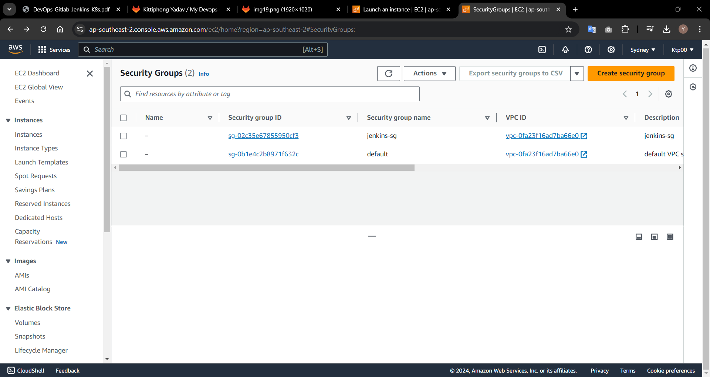
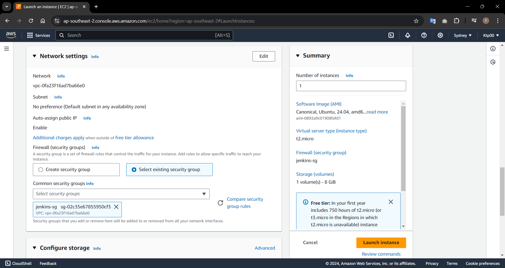

# SoftDev : Assignment 4 Jenkins & Pineline 
## ติดตั้ง Jenkins บน AWS
[Jenkins on AWS reference link](https://www.jenkins.io/doc/tutorials/tutorial-for-installing-jenkins-on-AWS/#installing-and-configuring-jenkins)
- ### สร้างและตั้งค่า Instances(VM) สำหรับ Jenkins ขึ้นมากก่อน
- ### เมื่อสร้าง Instances เสร็จแล้วจึงติดตั้ง Jenkins ลงใน Instances
### Overview Step ( ดูได้จากในเว็บไซต์ด้านบน )
**ขั้นตอนทั้งหมดในการสร้าง Instance ไปจนถึง ติดตั้งและ config Jenkins**
1. Prerequisites
1. Create a key pair using Amazon EC2. If you already have one, you can skip to step 3.
1. Create a security group for your Amazon EC2 instance. If you already have one, you can skip to step 4.
1. Launch an Amazon EC2 instance.
1. Install and configure Jenkins.
1. Clean up tutorial resources.

## Step 1  Prerequisites.
ทำการสมัครสมาชิก AWS ให้เรียบร้อย
## Step 2 Create a key pair
1. เปิด  Amazon EC2 console : [https://console.aws.amazon.com/ec2/](https://console.aws.amazon.com/ec2/)
1. ไปที่ Navigation pane -> NETWORK & SECURITY -> Key Pairs
1. คลิก Create key pair
1. ตั้งค่าตามภาพ แล้วกด create
    
1. ดาวน์โหลดไฟล์ .pem ไว้ที่ Desktop ใช้เป็น key สำหรับ ssh
1. จะปรากฎ key pair ชื่อที่เราพึ่งสร้างขึ้นมา
    
1. หมายเหตุ ถ้าใช้ macOS จะต้อง set permissions .pem file
    ```
    chmod 400 <key_pair_name>.pem
    ```
## Step 3 Create a security group
1. ไปที่ Navigation pane -> NETWORK & SECURITY ->  Security Groups
1. คลิก Create security group
1. ตั้งค่า Basic details
    
1. ตั้งค่า Inbound rules โดยการกดปุ่ม Add rule
    - HTTP
    - SSH
    - Custom TCP ที่ port 8080 สำหรับ Jenkins
    
1. กด Create แล้วจะปรากฎ security groups ใหม่ที่พึ่งสร้างชื่อ jenkins-sg
    
## Step 4 Launching an Amazon EC2 instance
1. ไปที่ [https://console.aws.amazon.com/ec2/](https://console.aws.amazon.com/ec2/)
1. กดปุ่ม Launch instance
1. ตั้งชื่อ Instance
    
1. เลือก image Amazon Linux, Architecture ตามภาพ
    
1. เลือก Instance type ตามที่จะใช้ (Free Tier เลือกได้แค่ t2.macro) และ เลือก Key pair ที่ได้สร้างไว้
    
1. เลือก Security Groups ที่ได้สร้างไว้
    
1. กด Launch instance และรอจนสร้าง instance เสร็จ
    

## Step 5 Installing and configuring Jenkins
### เชื่อมต่อไปที่ Instance Jenkins ผ่าน ssh ด้วยคำสั่ง หมายเหตุ ตรวจสอบใน AWS ว่า IP มีการเปลี่ยนแปลงหรือไม่
```
ssh -i "C:\Users\deefz\Desktop\windows-key.pem" ec2-user@3.106.113.37
```
### Downloading and installing Jenkins
1. Ensure that your software packages are up to date on your instance by using the following command to perform a quick software update:
    ```
    sudo yum update –y
    ```
1. Add the Jenkins repo using the following command:
    ```
    sudo wget -O /etc/yum.repos.d/jenkins.repo \
    https://pkg.jenkins.io/redhat-stable/jenkins.repo
    ```
1. Import a key file from Jenkins-CI to enable installation from the package:
    ```
    sudo rpm --import https://pkg.jenkins.io/redhat-stable/jenkins.io-2023.key

    sudo yum upgrade
    ```
1. Install Java (Amazon Linux 2023):
    ```
    sudo dnf install java-17-amazon-corretto -y
    ```
    or

    ```
    sudo dnf install java-17-amazon-corretto -y
    ```
1. Install Jenkins:
    ```
    sudo yum install jenkins -y
    ```
1. Enable the Jenkins service to start at boot:
    ```
    sudo systemctl enable jenkins
    ```
1. Start Jenkins as a service:
    ```
    sudo systemctl start jenkins
    ```
    You can check the status of the Jenkins service using the command:
    ```
    sudo systemctl status jenkins
    ```
ทดสอบ : `http://3.106.232.226:8080`  
### Configuring Jenkins
**ดูสไลด์ DevOps_Gitlab_Jenkins_k8s Version KTP หัวข้อ Jenkins ประกอบการ config**

**Workshop Gitlab Part Jenkins setup by KTP : [https://gitlab.com/ktpfw1110/my-devops](https://gitlab.com/ktpfw1110/my-devops#jenkins-setup)**
1. Unlock Jenkins
    
    - ssh เข้าไปที่ Jenkins Instance
        ```
        ssh -i "C:\Users\deefz\Desktop\windows-key.pem" ec2-user@3.106.232.226
        ```
    - เข้าไปที่ path "/var/lib/jenkins/secrets/initialAdminPassword" เพื่อนำ password มากรอก
        ```
        sudo cat /var/lib/jenkins/secrets/initialAdminPassword
        ```
        
    - copy password ที่แสดงมาใส่ในหน้า Unlock Jenkins
1. Customize Jenkins
    
1. Install Plugins
    
1. Create Admin User password : adminpass
    
1. Jenkins is ready
    
1. Add Credentials ไปที่ Dashboard -> Manage Jenkins -> Credentials -> System -> Global credentials (unrestricted) และกดปุ่ม New credentials
    
    username และ password ของ Gitlab, ID นำไปใช้ใน code Jenkinsfile
### Create New Jobs
1. กด New Item ตั้งชื่อ job และเลือก pipeline
    
1. เข้าไป config job ที่ชื่อว่า test_admin
    
    ถ้าใส่ Repo URL แล้ว error connection ลองติดตั้ง Git ดู
    ```
    sudo yum install git-all
    ```
1. เข้าไป config job ที่ชื่อว่า test_admin
    
1. จากนั้นกด Save
### Jenkinsfile (Pipeline Script)
